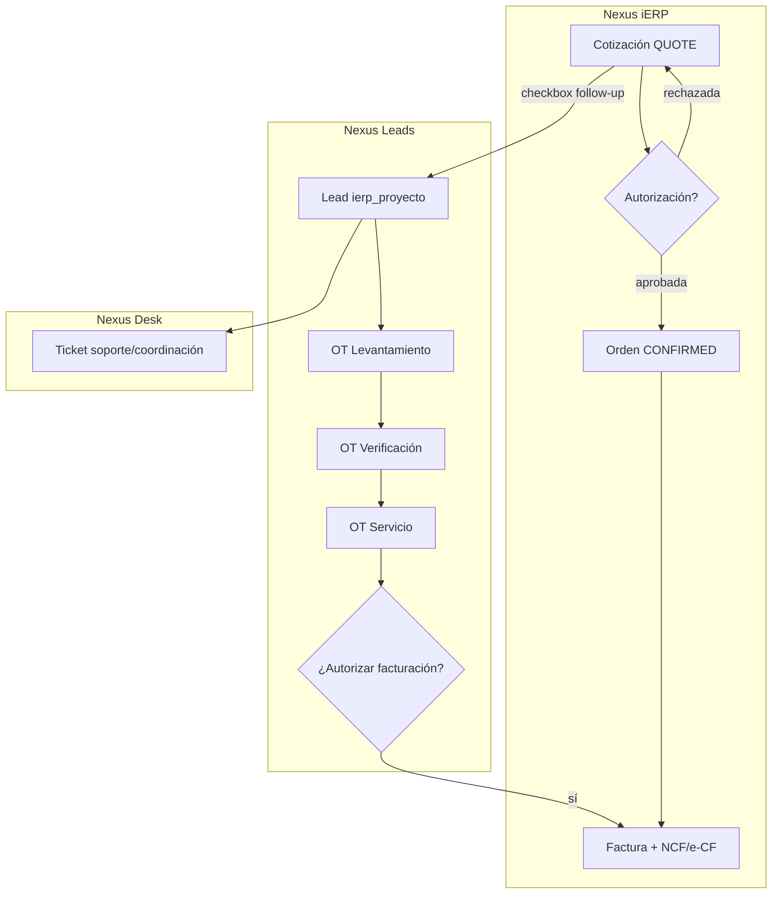

# Workflow comercial y operativo — Nexus modular (referencia ADM)

Este documento mapea capacidades de [ADM Cloud API](https://api.admcloud.net/swagger/ui/index) a la **división de módulos Nexus**, sin replicar el monolito. Cada módulo tiene responsabilidad clara; el flujo cruza APIs internas.

## Principio

| ADM (monolito) | Nexus (modular) |
|----------------|-----------------|
| Todo en un ERP | **iERP** = documentos, fiscal, inventario, contabilidad |
| Projects + WorkOrders + Tasks | **Nexus Leads** = hub de proyecto por cotización |
| ServiceRequests | **Nexus Desk** = tickets + IMAP |
| FiscalSequences + e-CF | **iERP** (secuencias NCF + panel e-CF) |
| Configuración global | **Configuración Nexus** (`/settings.html`) |
| Tienda / catálogo | **Nexus Store** (+ ADM opcional) |

---

## Flujo ADESA (energía + deportes)

---

## Fases de implementación (orden recomendado)

### Fase 1 — Estabilidad (ahora)
- [x] Catálogo de módulos en dashboard
- [x] Leads ↔ iERP (A–D) básico
- [x] Configuración Nexus (SMTP, toggles)
- [ ] IMAP Desk estable (opcional por división)

### Fase 2 — Workflow documental (iERP)
Equivalente ADM: `Quotes/Authorize`, `Reject`, `MarkPendingAuthorization`

| Estado iERP | Descripción |
|-------------|-------------|
| `QUOTE_DRAFT` | Borrador cotización |
| `QUOTE_PENDING_AUTH` | Espera aprobación |
| `QUOTE` | Aprobada / activa |
| `QUOTE_REJECTED` | Rechazada |
| `CONFIRMED` | Orden de venta |

**Reglas:**
- Solo roles `admin` / `aprobador_ventas` pueden autorizar.
- Al aprobar cotización con `nexusLeadsFollowUp` → sync Leads (estado `propuesta`).
- Al convertir a OV → sync Leads (`ganado` / `completado`).

### Fase 3 — Pipeline comercial (iERP + Leads)
Equivalente ADM: `ChangeSalesStage`, `Opportunities`

- Etapas en **iERP** (`PipelineStage`) ligadas a cotización.
- **Leads** muestra etapa comercial + estado proyecto (`activo`, `en_verificacion`, `completado`).
- No duplicar CRM completo en Leads: el lead es **vista operativa** del proyecto, no el maestro de cliente.

### Fase 4 — OT y servicio (Nexus Leads + Desk)
Equivalente ADM: `WorKOrders`, `ServiceRequests`, `Projects/Tasks`

| Vínculo Leads | Uso ADESA |
|---------------|-----------|
| `ot_levantamiento` | Visita técnica inicial |
| `ot_verificacion` | Validación post-instalación |
| `ot_servicio` | Mantenimiento / garantía |
| `desk_ticket` | Coordinación interna |

**Mejora vs ADM:** OT no vive en el ERP; solo dispara eventos (`ot.completed` → sugerir factura en iERP).

### Fase 5 — Autorización facturación OT (Leads → iERP)
Equivalente ADM: `WorkOrders/AuthorizeBilling`

- OT servicio `completado` + flag `autorizar_facturacion` → crea borrador factura servicio en iERP.
- Aprobador confirma en iERP (no en Leads).

### Fase 6 — Fiscal RD completo (iERP)
Equivalente ADM: `FiscalSequences`, `ElectronicInvoicingTransactions`

- Firma e-CF + polling DGII
- Void NCF al anular
- NC/ND electrónicas

### Fase 7 — Logística (iERP)
Equivalente ADM: `Dispatchs`, `Receptions`, `Serials`

- Despacho post-OV, seriales (bicicletería)

---

## Eventos entre módulos (contrato interno)

| Evento | Origen | Destino | Acción |
|--------|--------|---------|--------|
| `quote.follow_up_enabled` | iERP | Leads | `POST /api/office/leads/from-ierp` |
| `quote.status_changed` | iERP | Leads | `POST /api/office/leads/sync-ierp` |
| `quote.pending_authorization` | iERP | Config/notificaciones | Email a aprobador |
| `ot.created` | Leads | Mail + Desk opcional | Notificar asignado |
| `ot.completed` | Leads | iERP | Sugerir líneas factura servicio |
| `ticket.created` | Desk / Leads | Mail | Notificar buzón división |

---

## Configuración por división

En **Configuración Nexus** (`/settings.html`):

| Clave | Energía | Deportes |
|-------|---------|----------|
| SMTP | `smtp.energia` | `smtp.deportes` |
| Buzón Desk | soporte@adesa.com.do | info@labicicleteria.do |
| Workflow auth cotizaciones | configurable | configurable |
| IMAP | toggle | toggle |

El **iERP** guarda por tenant: NCF, empresa, URL Leads — no duplicar en Nexus salvo toggles globales.

---

## Qué NO meter en iERP (mantener ligero)

- Tareas de proyecto con chat/archivos (ADM `PA_Projects_*`) → **Leads** versión simplificada
- Tickets IMAP → **Desk**
- Membresías → **Hub** (futuro)
- Monitoreo medidores → **Grid** (futuro)

---

## Referencia rápida ADM → Nexus

| ADM API | Módulo Nexus | Prioridad |
|---------|--------------|-----------|
| Quotes + Authorize | iERP | Alta |
| SalesOrders | iERP | Hecho |
| Projects / WorkOrders | Leads | En curso |
| ServiceRequests | Desk | Parcial |
| FiscalSequences / e-CF | iERP | Parcial |
| PurchaseOrders Authorize | iERP | Media |
| Dispatchs / Serials | iERP | Media |
| Items / Stock | iERP + Store | Parcial |

---

## Fase 7 — Participantes y acceso externo

Ver **`docs/PARTICIPANTES-Y-ACCESO.md`**.

- [x] Directorio `nexus_personas` + API `/api/personas`
- [x] Etiquetar en Tasks y Leads + notificación email
- [ ] Portal acceso temporal (contratistas/clientes)
- [ ] Enlace usuario Nexus ↔ iERP empleado en Ajustes
- [ ] Cotización recibida de contratista ↔ OT/documento
